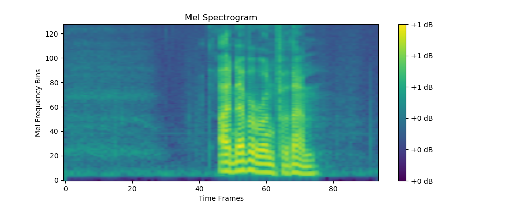

## NOAI2025 合成语音检测器

### 求解本题的参考用时：1小时-1.5小时

### 一. 题目描述

本题目是一个使用 PyTorch 实现的 ResNet 架构的深度学习项目，用于从人类录音中检测合成语音。

在现实生活中，合成语音（即 AI 生成的语音）已被广泛使用。虽然这项技术已经取得了显著进展，但它也引发了人们对潜在滥用的担忧，例如深度伪造和虚假信息。区分合成语音和真实人类语音的能力对于各种应用至关重要，包括内容验证，安全，和 AI 生成媒体中的道德考虑。生成模型的快速发展使得区分合成和真实人类录音越来越困难。本项目旨在开发一个能够有效区分这两种音频样本的模型。

> 注：本项目仅用于教育目的。使用的数据集是公开可用的，并且规模有限，使其适合在本竞赛中进行快速训练。该数据集收集于 2019 年，与最新模型相比，检测该数据集中的合成语音要容易得多。实际应用中的合成语音检测更具挑战性，需要更复杂的解决方案。该模型的表现可能无法很好地推广到现实场景中。

### 二. 数据集

本题的使用的原始数据是人类语音与合成语音的原始音频文件。然而，由于音频文件无法直接用于训练，因此需要先将音频转化为梅尔频谱图 (Mel Spectrum)。其生成过程可简单概括为如下步骤：

1. 首先对音频进行分帧、加窗处理；
2. 然后进行短时傅里叶变换（STFT），得到时频域信息；提示：可以使用大语言模型简单了解下傅里叶变换；
3. 接着用一组梅尔滤波器将线性频谱投影到梅尔尺度上（模拟人耳对频率的感知）；
4. 最后取对数，取对数后的单位为dB，得到最终的梅尔频谱图。

具体来说，梅尔频率 $m$ 与真实频率 $f$（单位 Hz）之间的转换关系为：

$$
m = 2595 \cdot \lg\left(1 + \frac{f}{700}\right).
$$

例如，假设我们有一个真实人类语音样本，时长约为 3 秒，采样率为 16kHz。我们将其转换为梅尔频谱图，使用如下常规参数：

- 采样率：16000 Hz
- 梅尔滤波器数量：128
- 帧移（hop length）：512
- FFT 窗口长度：1024

那么该音频在转换为梅尔频谱图后，将得到一个形如：

```
torch.Size([1, 128, 94])
```

的张量，其中：

- `1` 表示音频为单通道；
- `128` 表示频率轴上共 128 个梅尔频带；
- `94` 表示在时间轴上总共分为了 94 帧。

在视觉上，它是一张二维图像，其中横轴为时间帧，纵轴为梅尔频率。



由于这样的处理较为繁琐，因此本题目提供的数据集为原始音频文件转化过后的梅尔频谱图，而不是原始音频。其对应的频谱图均会保存为张量，以 `.pt` 格式进行存储。，训练集的存储地址为[训练集地址]()。带有`bonafide` 的文件名为真实人类录音的频谱图，而 `spoof` 文件夹中存储了所有合成语音的频谱图。

除去上述文件夹外，`dataset`中还含有脚本 `spectrogram_dataset.py`。 这是一个用于帮助加载频谱图并为训练模型提供 `PyTorch` 中 `Dataset` 接口的脚本。它将遍历每个数据集的子目录，并帮助标注标签（`bonafide` 为 0，`spoof` 为 1）。其 `__getitem__` 魔法方法将会返回一个形如 `{ 'spectrogram': Tensor, 'label': Tensor, 'path': str }` 的字典，其中`spectrogram` 为频谱图，`label` 为标签，`path` 为该频谱图的路径。在实际使用中，需要在程序中由以下语句导入：`from dataset.spectrogram_dataset import SpectrogramDataset`，然后即可以正常使用，例如`train_dataset = SpectrogramDataset('data/training_set')`。具体使用方法也可以参考[baseline.ipynb]()。

> 注意，在编写程序时请勿修改上述脚本，否则可能导致数据集加载错误。

验证集和测试集的数据选手无法直接访问，只能通过访问加密环境变量的方式进行访问，测试集和验证集只有图片，没有标签，具体访问方式可以参考[baseline.ipynb]()。

### 三. 任务

本项目旨在建立一个能够区分合成（AI 生成）语音和真实人类录音的模型。它使用从音频样本生成的频谱图作为 ResNet-based 神经网络的输入。你可以通过 `from torchvision.models import resnet18, ResNet18_Weights` 来加载在 ImageNet 数据集上预训练的 ResNet18 模型以及其参数，也可以选用其他版本的Resnet模型或者torchvision自带的其他视觉模型，具体方法可以参考[baseline.ipynb]()。

你的具体任务即在此基础上进行Fine-tune或者改变模型结构（增加或者删减）在训练集上进行训练，以达到对于合成语音的良好检测效果。

**提示：如果选择比Resnet18规模大的视觉模型，则需要控制训练的epoch数量，否则可能会出现在规定的时间内没有办法完成训练。也可以把这个题目纯当做一个计算机视觉（Computer Vision）的题目，使用自己编写的CNN模型解决问题。不要纠结于Mel Spectrum的物理实现过程，对于求解这道题目帮助不大。**

### 四. 提交

选手需提交一个名为"submission.ipynb" 的notebook文件，文件中可以只提交训练好的模型，然后省略模型的训练过程，以能够快速看到结果。能够输出包含预测结果的一个zip文件，zip中包含两个文件：

"submissionA.csv"：包含模型在验证集上的预测标签结果，每行一个 0 或 1，无表头；

"submissionB.csv"：包含模型在测试集上的预测标签结果，每行一个 0 或 1，无表头。

系统将读取"submission.zip"，并根据预测结果与真实标签计算 A 榜和 B榜分数，其中A榜分数为验证集的跑分，主要帮助选手调试代码，在比赛过程中可见；B榜分数是测试集的跑分，作为选手成绩排名依据。提交文件必须严格按照上述格式和命名，否则系统将无法正确读取。具体提交流程的代码也可参照[baseline.ipynb]()。

### 五. 评分

评分规则为将选手提交的 csv 文件与正确答案中的 `ground_truth_labels.csv` 进行比对。

具体评分标准使用 F1-score，用于衡量模型在二分类任务中的整体性能。其定义如下：
$$ \text{F1-score} = 2 \cdot \frac{\text{Precision} \cdot \text{Recall}}{\text{Precision} + \text{Recall}}$$其中，Precision表示模型预测为正类的样本中实际为正类的比例，Recall表示实际为正类的样本中被模型正确预测为正类的比例。最终成绩将在 $0$ 至 $1$ 之间，越靠近 $1$ 表示模型性能越好。
