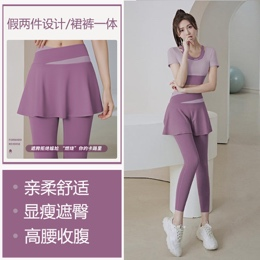
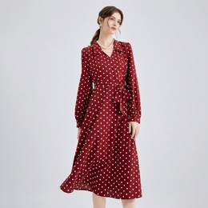
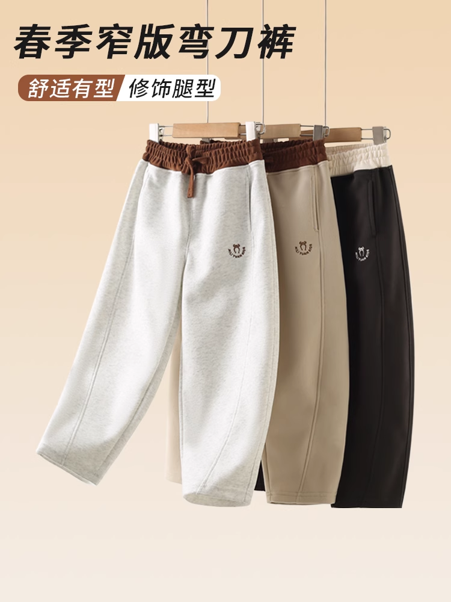

## NOAI2025 宫格图分类

### 求解本题的参考用时：1小时-2小时

### 一、题目概述
本题旨在设计并训练一个具备强鲁棒性的深度神经网络模型，用于自动判别输入图像是否为“宫格图”。**宫格图是一种将多张图片或同一张大图的不同区域，通过创意拼贴的方式组合成统一“格子”效果的图像形式**。在社交媒体、交互设计和广告宣传等场景中，宫格图凭借其独特的排版和视觉冲击力，能够显著提升用户关注度、点击率和转化率。模型需要在多种拼接布局（如规则网格、自由拼贴等）、不同分辨率与压缩质量环境下，依然保持高精度与良好泛化能力。

### 二、数据集
数据集从互联网中收集，主要包含女装和美妆两个类目的商品展示图片。
- **正样本示例：** 输入图片是宫格图

|  |  |  |  |
| :----------------------------------------------------------: | :----------------------------------------------------------: | :----------------------------------------------------------: | :----------------------------------------------------------: |

- **负样本示例**：输入图片不是宫格图

|  |  |  |  |
|:---:|:---:|:---:|:---:|

1. **训练集**

（1）图片属性：RGB，尺寸 256×256  

（2）样本量：1000 张

（3）训练集的标签存储在train.csv中，格式如下：`[id, 类目（女装/美妆）]`  

（4）训练集地址为[训练集地址](baseline.ipynb)，存储在data文件夹中

2. **验证集和测试集**

验证集和测试集分别包含100张图片和400张图片，格式和尺寸与训练集一样。验证集和测试集不能直接访问，需要通过加密后的环境变量进行访问读取，具体可以参考[baseline.ipynb]()。

### 三、任务要求 

本项目旨在建立一个能够区分宫格图和非宫格图的神经网络模型。选手使用 PyTorch 搭建模型并且选手可以自由设计网络结构、损失函数和优化器，最终的目的是区分图片是否是宫格图。

**提示：本题是一道无监督学习的题目，虽然train.csv中给出了类目，但是类目标号是区分"女装"或者"美妆"，而不是直接区分是否为宫格图，所以数据相当于没有给任何标签。选手需要使用计算机视觉中无监督学习的方法，使用训练集的数据让计算机自动区分宫格图；或者，如果时间充足，下载下来后，手动打标签再训练模型，也不失为一种可行的方案。**

### 四、提交内容  
选手需要提交一个"submission.ipynb"的notebook文件，文件中不需要包含训练过程的代码，文件可以输出一个名为"submission.zip"的zip文件，zip文件中应包含以下两个文件：
（1）"submissionA.csv"：包含模型在验证集（validation_set）上的预测标签结果，每行一个 0 或 1，无表头；其中0代表非宫格图，1代表宫格图。
（2）"submissionB.csv"：包含模型在测试集（testing_set）上的预测标签结果，每行一个 0 或 1，无表头。
系统将读取 submission.zip，并根据预测结果与真实标签计算A榜和 B榜分数，其中A榜分数会在比赛过程中显示，方便选手调模型；B帮榜分数在比赛中不显示，作为最终评分。提交文件必须严格按照上述格式和命名，否则系统将无法正确读取。具体提交流程的代码也可参照[baseline.ipynb]()。

### 五、评分标准
评分规则为将选手提交的csv文件与 `ground_truth_labels` 进行比对，以确定网络结构的预测能力。

具体评分标准使用准确率（Accuracy），即正确预测的样本数量除以总样本数量。